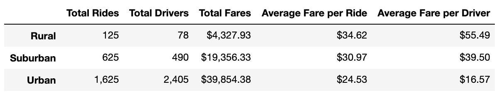
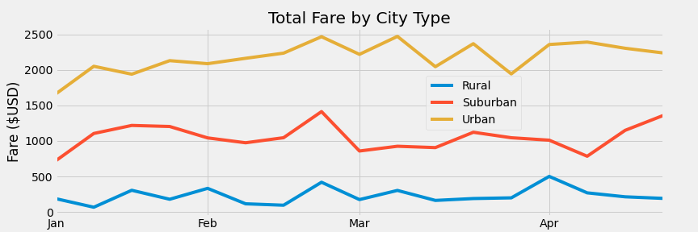

# PyBer Analysis
PyBer is a ride share app company and this analysis was done in Jupyter Notebooks with Pandas to analyze fares by city type (Rural, Urban, and Suburban). 

## Overview of the analysis
### Purpose
The purpose of the analysis was to explore differences in PyBer use by city type. These results will help the company to make profitable business plans specific to city type.

## Results

### Differences by City Type
The differences in ride-sharing data among different city types shows that as population density decreases (i.e. from Urban to Rural city type), total fares decreases while average fare per ride increases. This is demonstrated in the below table. 

  

### Differences Over Time

Of note, the trends in ride share use by month, show relatively consistent overall trends, as demonstrated in the Total Fare by City Type graph below. There is more variability in the urban data, however, all 3 city types show fluctuting trends over time.

  

## Summary
Given the differences in market demand based on city type, it is recommended that PyBer strategize marketing plans based on city type.

### Recommendations
In order to address disparities among the city types and improve business, PyBer should:
  1. Do market research on why PyBer is not used as frequently in Rural and Suburban areas to see if there is a business case for investing more resources to increase the total fares in these areas.
  2. In Urban areas, Pyber should incentivize riders to use PyBer over comptetitors as there is a high demand for ride share in this city type.
  3. Investigate the fluctuations in PyBer use over time. By investigating the peaks in PyBer use as demonstrated in the PyBer Fare by City Type line graph, PyBer could leverage this knowledge to increase app use.
  
